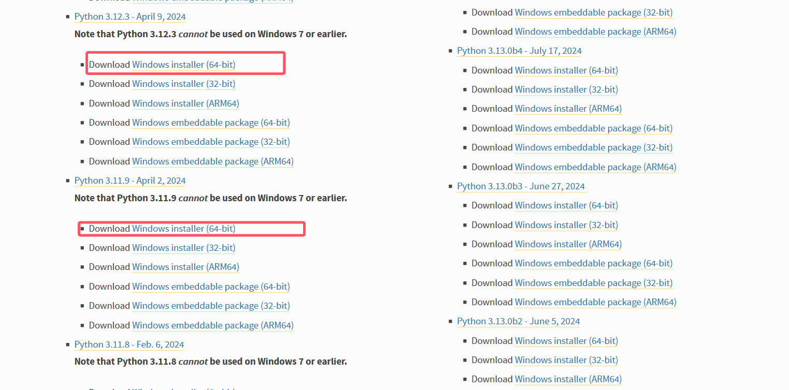
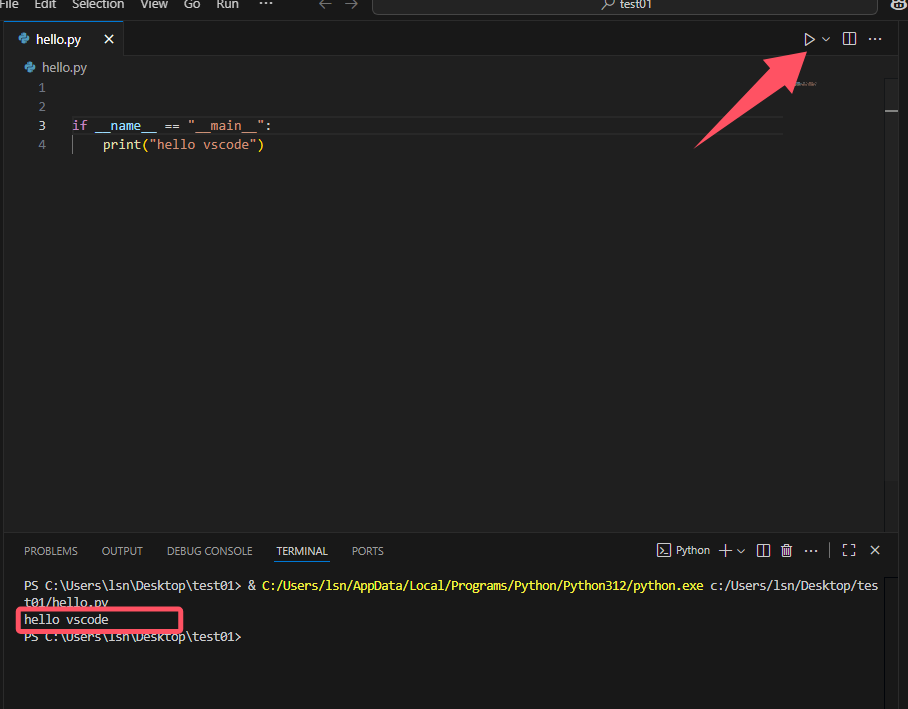

# Yanshee机器人介绍
[官网](https://yandev.ubtrobot.com/#/zh)

## 硬件信息
详见[Yanshee教育标准版](../res/Yanshee教育标准版.pdf)
与[Yanshee机器人开发指南](../res/Yanshee传感器模组.pdf)以及官网[指南](https://yandev.ubtrobot.com/#/zh/guide)。

## 软件下载
在官网[下载页面](https://yandev.ubtrobot.com/#/zh/download)可下载机器人固件以及app。


## 使用app连接机器人

长按机器人胸前按钮，等待蓝光亮起，启动机器人。打开下载安装完成的app，手机连接到wifi，注意wifi频率是2.4G。


点击app右上角按钮，进入设备搜索页面，选择对应的机器人连接即可。


#  开发环境

## python安装


### python下载

进入[python官网](https://www.python.org/)


选择合适的系统版本，这里以windows系统为例。


选择python版本，3.9<=**版本**<最新版。

 


### python安装

下载installer之后，点击安装。


**如果没装过python**，可以点击勾选下方的Add python.exe tp PATH。


然后点击自定义安装。


点击Next。


这里选项保持默认即可，可更换下方python的安装位置。点击Install安装。


安装完成之后，关闭窗口。


### python验证

安装完成之后，打开命令行终端（以window为例），按下键盘WIN+R，屏幕左下方会显示一个输入框，输入cmd确定后，会打开命令行终端。


或者在搜索中输入cmd打开。


在终端输入python，回车，终端会显示当前使用的python版本。


### 配置环境变量

若在终端输入python之后提示“不是内部或外部命令，也不是可运行的程序”，需要将python.exe配置到PATH环境变量中。


搜索“环境变量”，点击打开“**编辑系统环境变量**”


点击“环境变量”


在“系统变量”中找到“Path”一行，点击编辑。


点击“新建”，找到python的安装路径，以及该路径下的Scripts文件夹，把这两个文件夹的完整路径分别填到新建的变量中。

可添加多个python，点击右侧的“上移”“下移”移动变量的位置，优先使用在上面的变量。


点击确定。打开终端再次输入python，即可显示版本信息。


### 创建虚拟环境

不同版本的python、第三方库会依赖不同的库，直接使用pip会在全局python环境中安装库，这会导致不同版本库之间的兼容问题，所以建议为每一个项目单独创建一个虚拟环境，在虚拟环境中安装所需的库。

进入项目目录，在终端输入

```shell
python -m venv .venv
```

创建虚拟环境


### 激活虚拟环境

终端进入到.venv/Scripts目录，输入

```shell
./activate
```

激活环境，激活后，路径前面会显示虚拟环境名称。


输入

```
deactivate
```

取消激活环境。


## Nodejs安装

nodejs是javaScript的运行环境，后续课程使用的mcp需要nodejs环境。


### 下载

进入[nodejs官网](https://nodejs.org)，点击download。


选择合适的系统以及长期支持的版本（LTS），点击下载Window Installer。


### 安装

点击下载完成的安装包，保持默认选项，点击下一步，选择安装位置完成安装。


### 验证

安装完成后打开终端输入node，显示版本信息即安装成功。


### 配置运行权限

 **PowerShell 的执行策略 (Execution Policy)** 限制了脚本运行。默认情况下，Windows 可能会禁止运行 `.ps1` 脚本。

在powershell输入

```powershell
Get-ExecutionPolicy
```

默认情况下的输出为：**Restricted**


**修改运行策略**

在powershell输入：

```powershell
Set-ExecutionPolicy -Scope CurrentUser -ExecutionPolicy RemoteSigned
Get-ExecutionPolicy
```

显示RemoteSigned代表修改成功。


## GIT安装

git是一个代码管理工具。[官网](https://git-scm.com/downloads)


### 下载

选择合适的版本。


### 安装

下载完成后，点击安装包开始安装。


选择安装位置，点击下一步。


全都保持默认选项，点击下一步。


安装完成后关闭窗口即可。


### 验证

打开终端，输入git，会显示一下内容，说明安装成功。


## VSCode安装

Visual Studio code 是微软开发的一款IDE集成开发环境软件，后续课程的代码演示使用该软件。也可以使用其它软件如pycharm、cursor、trae等。


### 下载

进入[vscode官网](https://code.visualstudio.com/)，直接点击下载即可，其它系统点击右上方的下载，选择合适的版本。


### 安装

下载完成之后，点击安装。点击同意，下一步。


选择安装位置，点击下一步。后续选项保持默认即可，点击下一步。


点击安装。


点击完成。


### 语言设置

打开vscode，点击左侧的插件按钮，输入chinese，可安装汉化插件，安装完成后重启即可。


### 创建文件夹

在电脑上创建一个文件夹，打开vscode，点击左上方的文件按钮，点击打开文件夹，选择刚才创建的文件夹打开。


点击信任作者。


打开文件夹后，左上方会显示文件夹名称。


点击文件夹名称，右侧会显示操作图标，可以创建文件、文件夹等。


### 安装python插件

创建一个hello.py文件，打开，右下角会出现下载python插件的提示，直接安装即可。


如果没有出现提示，直接在插件中搜索python，手动安装 Python Debugger、Python Environments、Python即可。


点击允许访问。


安装完成后，打开hello.py文件，右上角会显示一个三角形。


### 运行python程序

在hello.py文件中编写示例代码。

```python
if __name__ == "__main__":
    print("hello vscode")
```

点击右上角面板显示按钮，可以显示/隐藏终端。


点击右上角允许该程序，下方的终端会输出"hello vscode"。




观察终端输出的上一行：

```shell
 C:/Users/lsn/AppData/Programs/Python/Python312/python.exe c:/Users/lsn/Desktop/teste1/hello.py
```

+ ...python.exe ：这个就是之前安装的python
+ ...hello.py ：这个是我们编写的程序

这个命令就是终端执行python程序的命令

```shell
python xxx.py
```

因为我们添加了python的环境变量，所以可以不输入完整的python路径。

在终端输入：

```shell
python hello.py
```


可以看到程序正常运行了。不过python后面的hello.py文件也不是完整路径，因为当前终端所在的路径是...\test01，也就是hello.py文件所在的路径，那么执行命令的时候，python会在当前文件寻找hello.py文件进行执行，所以不需要完整路径。

我们在终端输入：

```shell
cd ..
```


可以看到当前路径变成了test01的上一级目录。

我们再次执行hello.py文件。


可以看到执行出现错误：没有这个文件或者目录。

我们在终端输入ls来查看当前目录下的文件和文件夹：

```shell
ls
```


可以看到，当前目录下确实没有hello.py这个文件，所以执行错误。

那么，我们在终端输入：

```python
python ./test01/hello.py
```


可以看到程序再次成功运行。                                                                                                                                                                                                                                                                                                                                                                                                                                                                                                                                                                                                                                                                                                                                                                                                                                                                                                                                                                                                                                                                                                                                                                                                                                                                                                                                                                                                                                                                                                                                                                                                                                                                                                                                                                                                                                                                                                                                                                                                                                                

综上，在终端运行python程序时，你可以cd到程序所在的目录下后，执行程序；或者输入完整/相对路径来执行。


### Copilot

copilot是vscode自带的一个AI插件，打开vscode点击右上方的机器人图标，即可打开对话框。


使用github登录copilot。


登录后可在输入框输入文本进行对话，对话框下方可以选择模型。


输入#hello，copilot会匹配对应的文件，选择需要的文件可以将其添加为上下文。


输入文本让它添加功能。


模型输出了结果，但是没有添加到文件中，因为当前的模式是“Ask”（对话框左下角），将模式改为Edit/Agent后，让它把新内容添加到文件中。


模型执行完成后，hello.py文件中出现了新的内容。可以检测内容是否是需要的，然后选择Keep/Undo。


每段对话上方都有一个checkpoint，点击后可以将操作撤销，回到执行这个操作之前。


### Lingma

通义灵码是阿里开发的一个AI插件。在插件中搜索lingma安装。


注册登录阿里云账号后使用。


与copilot类似，可在对话框左下角调整模式、模型


#### 语言设置

点击右上角的设置按钮，将settings中最底下的三个语言设置为中文即可。


## CUDA+cuDNN安装

> 这部分的进行，需要电脑安装了英伟达Nvidia的显卡

### Nvidia显卡驱动安装

查看任务栏中是否有英伟达显卡驱动的图标，如果有说明已经安装了驱动，跳过显卡驱动安装这一步。


进入[Nvidia官网](https://www.nvidia.cn/geforce/campaigns/back-to-school/?ncid=pa-srch-baid-450176)，点击驱动程序。


#### 确认显卡型号

按下Ctrl+Alt+Delete，或者右键点击任务栏，打开任务管理器。


在“性能”栏下找到对应的显卡，查看显卡型号。


或者在搜索中搜索“设备管理器”，打开


在“显示适配器”下找到显卡，确认型号。


#### 下载显卡驱动

填入相关信息，搜索驱动程序。


选择最新版本的驱动下载，GeForce Game Ready和NVIDIA Studio都可以。


点击立即下载，下载完成后点击安装，选择默认选项，点击下一步完成安装即可。


#### 验证CUDA Version

安装完成后，在终端输入：

```shell
nvidia-smi
```

控制台会输出显卡信息：CUDA Version：12.9 --》就是当前最高支持的CUDA版本。


### CUDA安装


#### 下载

进入[Nvidia开发者平台](https://developer.nvidia.com/)，点击Platforms and Tools——Developer Tools Catalog


点击搜索框，输入CUDA Tool，选择CUDA Toolkit，点击下载。


点击Archive of Previous CUDA Releases。


由前面[验证](#验证CUDA Version)已知，CUDA Version为12.9，所以小于12.9版本的都可以下载，不过一般使用稳定的版本，如11.8、12.8（可以下载多个版本CUDA）。


选择一个版本，选择合适的系统版本，点击下载。


#### 安装

下载完成点击运行，选择解压位置。


点击同意继续，


点击“自定义”，下一步，保持默认选项，下一步


可以更换位置，点击下一步，然后等待安装完成。


安装完成，进入安装目录，可以看到以下内容：


#### 配置环境变量

打开系统环境变量。如果CUDA安装成功，在“系统变量”中会生成两个变量：

+ CUDA_PATH：使用的CUDA的路径，可以更改这个路径来更换CUDA版本。
+ CUDA_PATH_V版本： 具体版本CUDA的安装路径。


在“系统变量”找到Path，编辑，找到含有安装CUDA路径的变量，这里我安装了两个版本CUDA，所以分别有两个版本的变量，如果没有，手动添加即可。可以移动需要使用的版本到上面来切换CUDA版本。


#### 验证CUDA

打开终端输入，可以看到输出的对应cuda版本：

```shell
nvcc -V
```


#### 切换CUDA版本

按照之前安装教程，安装两个不同版本。

打开终端输入：

```shell
nvcc -V
```

或

```shell
nvcc --version
```


打开系统环境变量，查看CUDA_PATH，可以看到路径对应的是CUDA11.8，把它改为12.8


点击编辑path，将cuda12.8的两个变量移动到最上方（相对其他cuda版本变量），或者直接添加新的变量，点击确认。


打开**新的**终端，查看cuda版本，可以看到，版本已切换为12.8：


### cuDNN安装

Nvidia开发者平台搜索cudnn，点击进入。


点击下载cuDNN


点击Archive of Previous Releases，


<span style="color:#0B99FF"> 这里cuDNN 9.x版本均为12.x版本CUDA可用的cuDNN </span>，可以直接点击下载，


<span style="color:#FF5263">点击cuDNN 8.x可以下载以前的版本，</span>点击下载合适的版本即可。


点击下载，需要登录，正常注册登录即可。


下载完成后解压


打开解压的文件夹，可以看到三个文件夹


打开cuda安装的路径，可以看到也有三个对应的文件夹。


需要将cuDNN三个文件夹中的内容分别复制到cuda对应的三个文件夹中：

#### bin


#### include


#### lib


## Pytorch安装

pytorch是一个深度学习框架，在后续的yolo模型训练推理中会使用到。


### 下载

进入[pytorch官网](https://pytorch.org/)，点击get started


选择合适的系统版本，复制pip下载命令在终端执行即可（建议单独创建一个虚拟环境），


点击 install previous versions of PyTorch下载以前版本，选择合适的系统与版本，复制pip命令在终端执行即可。


查看已安装包，终端输入

```shell
pip list
```


### 验证pytorch

创建一个python文件，编写代码，执行，能够输出版本号并且正常执行，说明安装成功。

```python
import torch

print("PyTorch version:", torch.__version__)
print("CUDA available:", torch.cuda.is_available())
print("cuDNN enabled:", torch.backends.cudnn.enabled)
print("cuDNN version:", torch.backends.cudnn.version())

# 构造一个卷积运算（会调用 cuDNN）
x = torch.randn(10, 3, 224, 224).cuda()  # batch=10, 3通道, 224x224
conv = torch.nn.Conv2d(3, 32, 3).cuda()

y = conv(x)
print("Conv2D output shape:", y.shape)

```


## 远程连接工具（任选）

### windows自带ssh工具

[官网](https://learn.microsoft.com/zh-cn/windows/terminal/tutorials/ssh)


在“设置”》“可选功能”中搜索并添加openssh


打开终端输入ssh


远程连接

```shell
ssh 用户名@ip
```


输入yes，输入密码，即可连接。


### FinalShell

FinalShell集成远程连接与文件传输。[官网](https://www.hostbuf.com/t/988.html)，选择合适版本下载安装即可


安装后打开，点击文件夹


创建SSH连接


输入信息，确认


双击打开连接


还有其他工具如xshell等，自行选择


## 文件传输

### FinalShell

打开一个连接，将文件直接拖动到需要传输的位置即可传输。


### FileZilla

[官网](https://filezilla-project.org/)，点击下载安装。


输入配置信息连接，拖动文件即可传输。


### WinSCP

[官网](https://winscp.net/eng/index.php)，点击下载安装。


打开，创建连接，输入配置信息，连接后拖拽文件即可传输。


